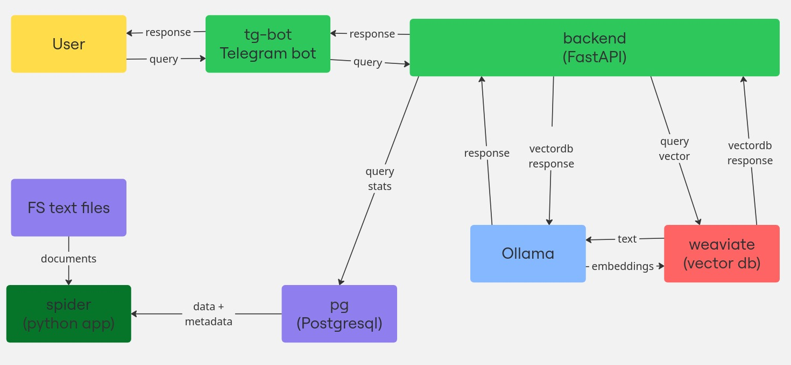

# cat-search

Решение задачи VK HR Tek Информационный поиск.

# Описание решения

Мы решили реализовать RAG со следующими компонентами:
- Векторная БД: weaviate.
- Ollama сервер для запуска моделей LLM и эмбеддингов.
- Бэкенд FastAPI, Langchain.
- Фронтенд: Telegram bot.
- Postgresql: БД для хранения информации о запросах.

Все компоненты упакованы в docker. Проект запускается docker compose.

Решение выложено в виде 4-х репозиториев:
- 1: https://github.com/cat-search/cat-search

    Описание и docker-compose.yaml для запуска всего проекта.

- 2: https://github.com/cat-search/cat-backend

    Бэкенд FastAPI.

- 3: https://github.com/cat-search/tg-bot

    Телеграм бот.

- 3: https://github.com/cat-search/cat-spider

    Спайдер: загрузчик данных в векторную БД.     

# Установка

1. Сборка образа cat-spider

```shell
git clone https://github.com/cat-search/cat-spider.git \
  && cd cat-spider \ 
  && docker build -t cat-spider . \
  && cd ..
```

2. Сборка образа cat-backend

```shell
git clone https://github.com/cat-search/cat-backend.git \
  && cd cat-backend \
  && docker build -t cat-backend . \
  && cd ..
```

3. Cборка образа tg-bot

```shell
git clone  https://github.com/cat-search/tg-bot.git \
  && cd tg-bot \
  && docker build -t tg-bot . \
  && cd ..
```

4. Запуск всего проекта

В .env можно указать каталог ФС, в который будут сохраняться данные.
По-умолчанию данные будут сохраняться в каталог `./catsearch`. 

```shell
git clone https://github.com/cat-search/cat-search.git
  && cd cat-search \
  && docker compose up -d
```

# Описание запуска

- Запустятся `ollama`, `weaviate`, `pg`. `ollama` будет пуллить модели.
- `spider` запуститься и будет ожидать готовности `weaviate`, `pg`, `ollama`. Далее начнет загрузку
  текстовых документов их папки ./files, которая монтируется в контейнер.
- Запустится `backend`. На нем работает swagger и он будет ожидать запросы от `tg-bot`.

# Архитектура


